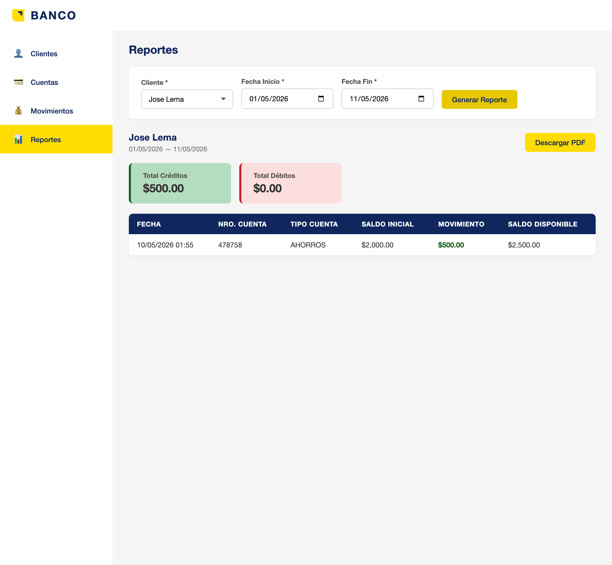

# Fullstack Bank System



Este proyecto es un sistema bancario fullstack desarrollado y documentado por **Daniel Salgado**.

## Tecnologías principales

### Backend (`bank-msa-account-movements`)
- Java 17
- Spring Boot 3.2.5
- PostgreSQL 15
- Maven
- JPA (estrategia JOINED)
- Docker
- iText7 (PDF)
- springdoc-openapi
- JUnit/Mockito
- Lombok

### Frontend (`bank-mfa-account-movements`)
- Angular 21
- SCSS (BEM)
- Jest
- Signals
- Standalone components
- Docker (nginx)
- Node.js 22.x
- npm 10

## Requisitos previos
- **Docker** instalado (se recomienda [OrbStack](https://orbstack.dev/) para macOS/Apple Silicon)
- Node.js >= 22.x (probado con v22.14.0)
- Maven

## Instrucciones generales

### 1. Clonar el repositorio
```bash
git clone <url-del-repo>
cd fullstack-bank-system
```

### 2. Backend

Ir a la carpeta del backend:
```bash
cd bank-msa-account-movements
```

- Para correr localmente:
  ```bash
  mvn spring-boot:run
  ```
- Para correr con Docker:
  ```bash
  docker compose up --build
  ```
- Más detalles en `bank-msa-account-movements/README.md`

### 3. Frontend

Ir a la carpeta del frontend:
```bash
cd bank-mfa-account-movements
```

- Instalar dependencias:
  ```bash
  npm install
  ```
- Para desarrollo local:
  ```bash
  npm start
  ```
- Para correr con Docker:
  ```bash
  docker compose up --build
  ```
- Más detalles en `bank-mfa-account-movements/README.md`

## Notas
- El sistema está preparado para ejecutarse tanto en desarrollo local como en contenedores Docker.
- Se recomienda usar OrbStack para un entorno Docker optimizado en macOS/Apple Silicon.
- Cada módulo tiene su propio README con instrucciones detalladas.

---

Propiedad de **Daniel Salgado**.
